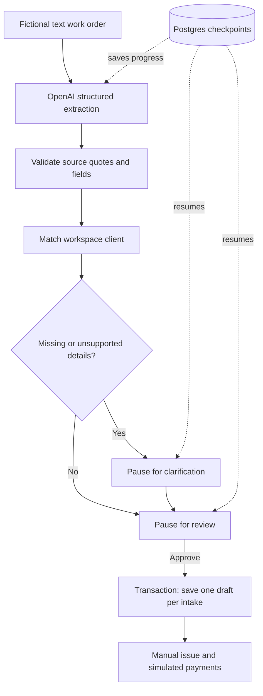

# Ledgerly

An invoicing demo for freelance work: create a draft, issue it, record partial payments, and track the remaining balance. AI intake turns a fictional work order into proposed fields, then waits for clarification and approval before saving.

The responsive interface includes a collections chart, searchable invoices, client balances, source quotes, and saved intake progress. All clients and activity are fictional. Sending and payments are simulated.

## Demo modes

| Mode                         | What runs                                                                             | Persistence                                    |
| ---------------------------- | ------------------------------------------------------------------------------------- | ---------------------------------------------- |
| Sample                       | Manual invoice workflow and a prepared extraction example. No backend or AI requests. | This tab's session storage.                    |
| Live, with an invitation key | Express, Postgres, OpenAI extraction, LangGraph intake.                               | Same browser session, accessible for 24 hours. |

[Open the live demo](https://ledgerly-production-afee.up.railway.app/) or [try the static sample](https://scott-garvin.github.io/invoice-dashboard/). The live demo runs on Railway with invite-gated AI and database access. The static sample works without a key and links to the live version.

The **demo access key** goes in the app's key dialog. The **OpenAI API key** belongs in the backend environment only. Reloading clears the demo key from page memory; entering it again restores the existing session while its cookie is valid.

## AI workflow



LangGraph runs on the backend. Its extraction, validation, clarification, review, and save nodes use `PostgresSaver` in a private `ledgerly_graph` schema. Intake resumes after a reload or server restart. Failed extraction requires explicit retry, which consumes another attempt if it calls the provider again.

Code checks that quoted evidence exists in the source. This proves provenance, not correct interpretation. The reviewer checks the client, quantities, rates, currency, due date, and tax. The model never issues invoices or records payments.

This is not RAG and does not need a vector database. Intake uses the submitted work order and a scoped client list. Company matching is exact and case-insensitive; ambiguous matches require clarification.

## Stack and code map

| Part     | Implementation                                                      |
| -------- | ------------------------------------------------------------------- |
| Frontend | Vue 3, TypeScript, Vite, Lucide, custom CSS                         |
| API      | Express 5, Zod, PostgreSQL via pg                                   |
| AI       | OpenAI Responses structured output; LangGraph orchestration         |
| Domain   | `shared/domain.ts`: integer cents, invoice states, payment ledger   |
| Intake   | `server/intake.ts`: checkpoints, ownership, review, idempotent save |
| Provider | `server/provider.ts`: bounded provider request and validation       |
| Storage  | `server/store.ts`, `server/schema.sql`: transactions and quotas     |
| UI       | `src/App.vue` and invoice/intake components in `src/components`     |
| Tests    | Vitest, Supertest with Postgres, Playwright desktop/mobile          |

Each demo workspace is a bounded JSON aggregate in Postgres. Row locks serialize changes and version checks reject stale writes. A commercial accounting service would need a more extensive relational model and identity system.

## Run locally

Use Node **22.12 or newer** and Docker Desktop.

```sh
npm ci
docker compose up -d db
# Copy .env.example to .env using your shell or editor.
npm run dev:api
# In a second terminal:
npm run dev
```

Open `http://127.0.0.1:5174/`. Vite proxies the API to port 8081. Set a random `DEMO_ACCESS_KEY` for any shared environment. The example key is public and only suitable for local use.

To enable AI, set `OPENAI_API_KEY` and `OPENAI_MODEL` in `.env`. Without a provider key, manual invoicing still works. Live source text is sent to OpenAI; use fictional data. Uploads support UTF-8 `.txt` and `.md` under 8 KB; API text is limited to 8,000 characters. There is no PDF/OCR support.

For an entirely containerized local demo:

```sh
docker compose up --build
```

Open `http://127.0.0.1:8081/`. Compose uses public local credentials and does not forward provider credentials. Explicitly supply provider environment variables to enable AI in the container. Stop any other API already using port 8081 first. The database volume persists across restarts.

## Verification and GitHub automation

```sh
npm test
npm run build
npm run build:server
npx playwright install chromium
npm run test:e2e
docker build -t ledgerly .
```

Set `TEST_DATABASE_URL` to a **separate, disposable Postgres database**. Tests truncate its session and usage tables and never fall back to `DATABASE_URL`. Without it, database and live browser tests are explicitly skipped. Build the frontend before live browser tests.

Tests cover exact money, payment transitions, overpayments, concurrent writes, session isolation, quotas, graph restart/resume, clarification, stale approvals, duplicate saves, and reset invalidation. Browser tests exercise manual and graph workflows on desktop and mobile. Their provider is deterministic: no paid AI calls.

PR checks install dependencies, audit known vulnerabilities, run database/browser tests, compile both applications, and build Docker. Pages deployment depends on these checks. Separate workflows run CodeQL and Gitleaks; Dependabot proposes updates. See the Actions tab for results on each commit.

## Boundaries and hosting

- USD and whole quantities only. Tax is an explicitly reviewed percentage, rounded half-up once per invoice. Downloads are CSV and plain text.
- Drafts can be edited. Issued invoices accept partial payments. Paid invoices cannot be voided. The history records simulated activity.
- The API requires an invitation key plus a random HttpOnly session cookie, with SameSite Strict and Secure in production. Intake ownership is checked before checkpoint access.
- Approval saves the invoice and intake result in one transaction. Retrying the save node returns the recorded invoice ID. Checkpointing alone does not guarantee exactly-once writes.
- Daily/monthly AI attempt limits are shared in Postgres. Defaults: 20/200. Failed attempts count, and reset does not replenish quota. These are request limits, not dollar caps.
- Limits: 100 clients, 200 invoices, 20 intake starts per session, bounded request bodies/source/output, and a provider timeout. Reset invalidates saved intakes. The general burst limiter is per process; add an edge limiter for multiple replicas.
- Session expiry blocks access after 24 hours. It does **not** purge rows or checkpoint history. Configure retention cleanup before collecting anything beyond fictional demo data.
- The hosted demo shares a Supabase database with Harbor, using dedicated `ledgerly_app` and `ledgerly_graph` schemas and a separate `ledgerly_runtime` login. That login has no access to Harbor tables. Hosted connections verify the Supabase certificate and hostname. The local Docker superuser bypasses RLS; production uses a non-superuser role with forced session RLS.
- Hosting needs HTTPS, backend secrets, a suitable database role, provider billing limits, and tested backups. Real email, payment processing, commercial authentication, and accounting compliance are outside this demo.

[Portfolio](https://scott-garvin.github.io/) | [Related API hardening project](https://github.com/scott-garvin/invoice-api-hardening)

MIT. See [LICENSE](LICENSE).

## Deployment configuration

The Docker service serves the frontend and API from the same HTTPS origin. Railway uses `/api/health`, one replica, and sleeping when idle. Provider and database credentials are runtime variables; no secrets enter the frontend bundle. GitHub Pages only builds sample mode and points its live-access link at Railway.

Set `DATABASE_SCHEMA=ledgerly_app` and `MIGRATE_ON_START=false` for the hosted database. Run `node node_modules/tsx/dist/cli.mjs scripts/migrate.ts` separately under a migration role with the required schema privileges before deploying schema changes. The runtime role does not retain database-wide CREATE permission. Local development defaults to automatic migration. `server/certs/supabase-ca.crt` is Supabase's public root certificate, downloaded from the database settings page; it contains no private key. The hosted database URL uses `sslmode=verify-full` and `sslrootcert=server/certs/supabase-ca.crt`.

## External assistant integration

The [read-only MCP integration](mcp/README.md) exposes invoice lookup and code-calculated receivables summaries. Run `npm run mcp:demo` for a real MCP client/server exchange using fictional data, with no model key required. The guide includes assistant configuration, optional hosted API mode, tests, and explicit privacy and authorization limits.
